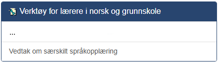
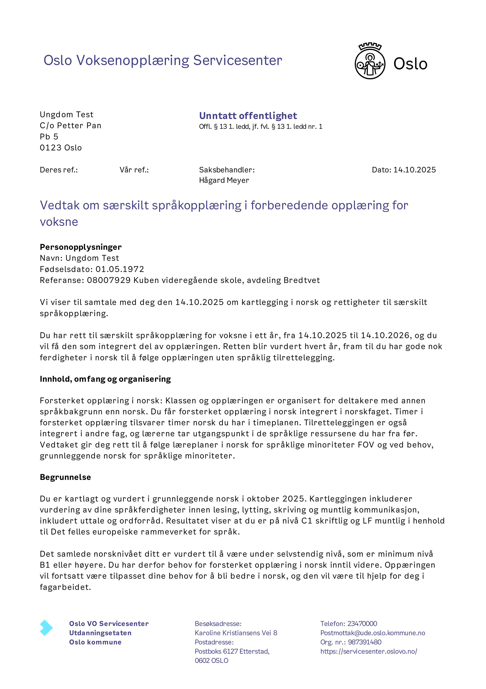
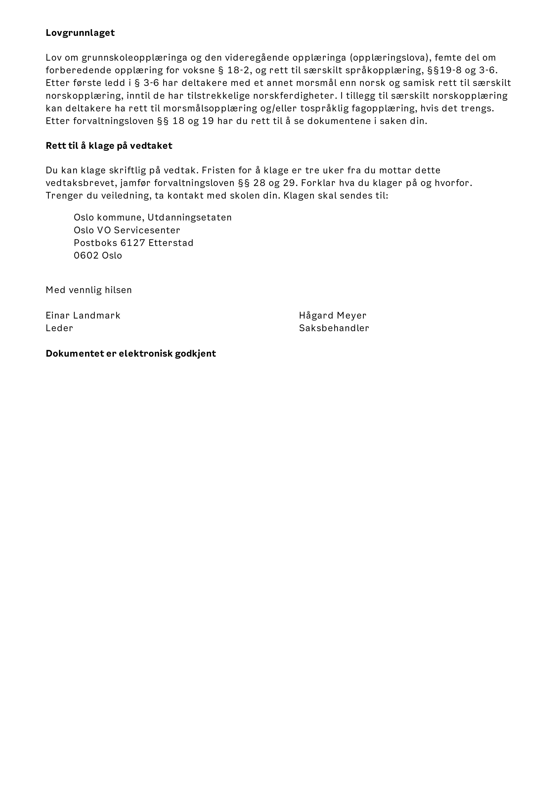

# Vedtak om særskilt språkopplæring
??? info "Hvorfor gjør vi dette?"
    Etter oppstart i forberedende opplæring for voksne, skal skolen minimum årlig kartlegge om deltakeren kan norsk godt nok til å følge den vanlige opplæringen, §19-8, jamfør §3-6. Resultatet av kartleggingen utgjør grunnlaget for et vedtak om særskilt språkopplæring, og for beskrivelsen av innhold og organisering av opplæringen.
	
	I praksis betyr dette at vi gir vedtak om særskilt språkopplæring som er gyldig i 1 år om gangen. I e:Vision får du opp alle deltakere i klassen som enten mangler vedtak eller som har midre enn 6 måneder igjen av forrige vedtak om særskilt språkopplæring.

## Før du går i gang med å fatte vedtak må du ha
- kartlagt og vurdert hvilke elever i klassen din som har behov for særskilt språkopplæring
- hatt en samtale med deltaker der du orienterer hen om vurderingen og vedtaket om særskilt språkopplæring

## Fremgangsmetode

Trykk på **Vedtak om særskilt språkopplæring** under **Verktøy for lærere i norsk og grunnskole** under **Lærer** i e:Vision

### Velg hvilken klasse du skal behandle i menyen og trykk **neste**

??? info "Jeg får opp flere klasser i listen."
    Prosessen gjøres klassevis. Har du flere klasser du skal vurdere for må du først velge en klasse å gå gjennom prosessen for den. Så kan du starte prosessen på nytt og velge en annen klasse.

??? info "Det var ingen av deltakerne i *klassen* som kan få nytt vedtak på nåværende tidspunkt."
    Får du opp en rapport som viser klassen din med denne overskriften kan du være trygg på at det ikke er noen å vurdere i klassen din. De har enten fått nei, eller har lenge igjen på nåværende vedtak.

### Fyll inn skjema for hver deltaker

|Overskrift|Hva skal fylles inn?|
|---|---|
|Muntlig nivå|Muntlig nivå deltaker er på i følge den europeiske rammeverket.|
|Skriftlig nivå|Skriftlig nivå deltaker er på i følge den europeiske rammeverket.|
|Rask|Huk av hvis du opplever deltakers prograsjon som rask.|
|Vedtak|**Ja** betyr at du har vurdert et behov for særskilt opplæring og vil sende et vedtak om dette.  **Nei** betyr at du ikke vurderer et behov for særskilt språkopplæring.  **En tom boks** betyr at du ikke ønsker å vurdere deltaker nå|
|Samtaledato|Fylles inn med dato lærer snakket med deltaker om vurdering og behov for særskilt språkopplæring|

??? info "Hva består skjemaet av?"
	|Overskrift|Betydning|
	|---|---|
	|Deltakernr|SPR-nummer på deltaker|
	|Navn|Fullt navn på deltaker
	|Antall vedtak - Ikke|Antall ganger det har blitt vurdert at det ikke er behov for særskilt språkopplæring|
	|Antall vedtak innvilget|Antall ganger det har blitt vurdert at det er behov for særskilt språkopplæring|
	|Maks sluttdato|Når den siste avgjørelsen av behov om særskilt språkopplæring går ut|
	|Status nyeste vedtak|Om den siste vurderingen var at det var behov eller ikke behov for særskilt språkopplæring|
	|Muntlig nivå|Muntlig nivå deltaker er på nå. Kan oppdateres av lærer.|
	|Skriftlig nivå|Skriftlig nivå deltaker er på nå. Kan oppdateres av lærer.|
	|Rask|Om deltaker har rask progresjon. Kan oppdateres av lærer.|
	|Vedtak|Fylles inn med avgjørelse om deltaker skal ha særskilt språkopplæring eller ei|
	|Samtaledato|Fylles inn med dato lærer snakket med deltaker om vurdering og behov for særskilt språkopplæring|

??? warning "Hva gjør jeg hvis jeg har registrert en feil i skjemaet?"
    Hvis du har registrert noe feil før du har trykket **neste**, eller du får en rapport med mangler, kan du bare endre verdien til det riktige. Hvis du er usikker på hva det originale verdien var kan du lukke prosessen og åpne den igjen.
	

### Når du har trykket **neste** fra skjemet begynner eVision å lage vedtak. 
Disse sendes ut automatisk til deltaker neste dag. Når det er ferdig får du en rapport der det står endringer, se gjennom denne og trykk **Ferdig**.

??? warning "Hva gjør jeg hvis jeg ser en feil etter at vedtakene er laget?"
    Hvis du har registrert noe feil etter at SITS har kjørt ferdig prosessen, enten med norsknivå eller feilvurdering av vedtaksbehov, må du ta kontakt med deltakerkontoret på skolen din. Beskriv feilen slik at de kan rette opp. Gjør gjerne dette så raskt som mulig så vi ikke sender ut vedtaksbrev med feil.

??? info "Hvordan ser vedtaket ut?"
    Du får ikke sett vedtakene direkte da disse lages av SITS og sendes direkte ut. Under ser du et eksempel på et vedtaksbrev. Det som vil endre seg er informasjon om senteret, informasjon om deltaker, navn på saksbehandler (deg) og datoer.
	
	

Oppdatert 13.10.2025 av Hågard Meyer